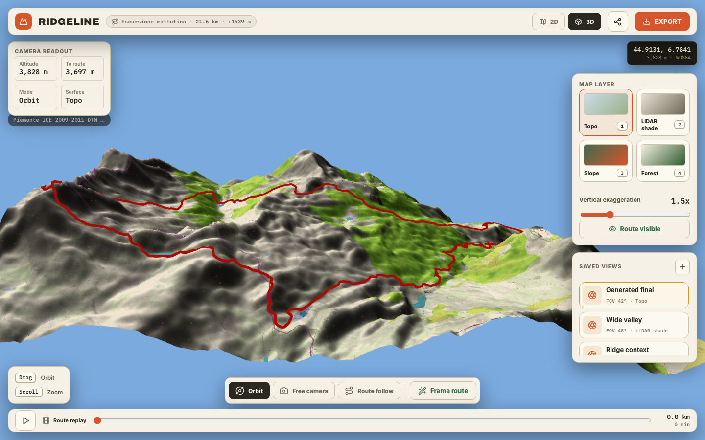
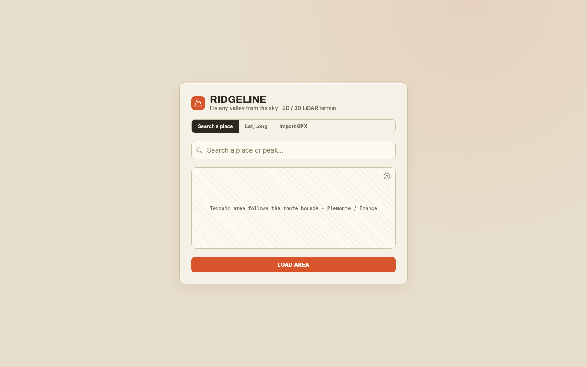
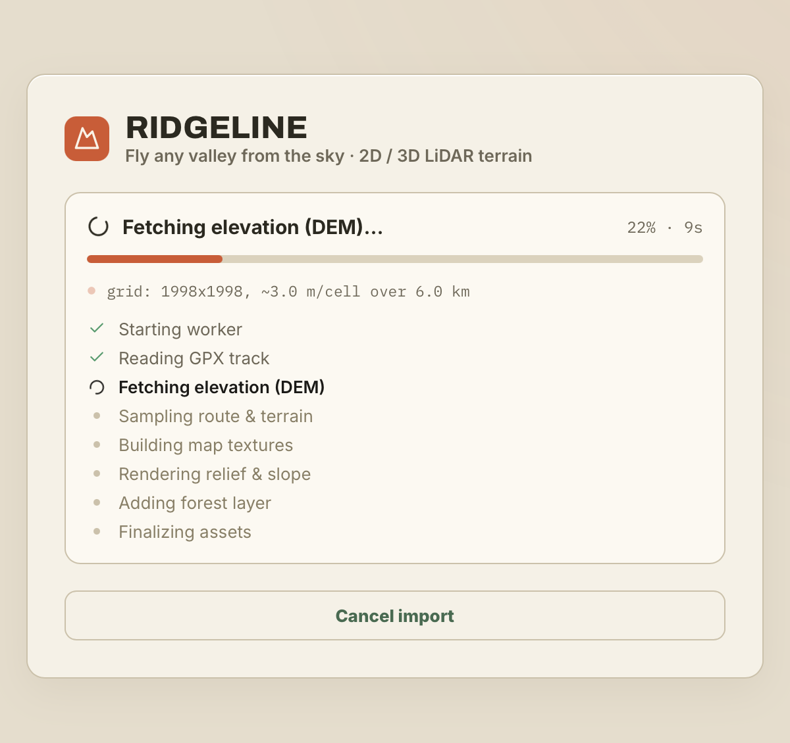
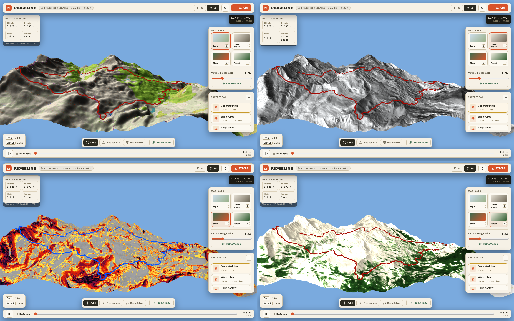
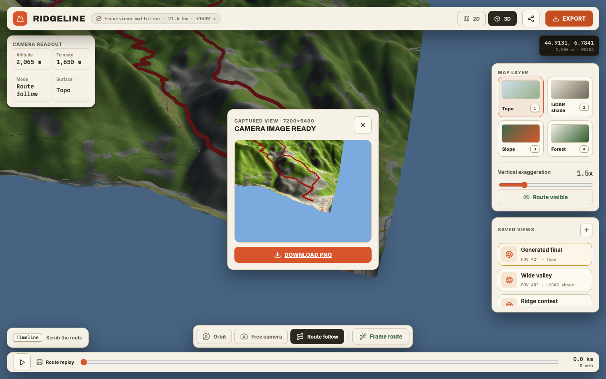
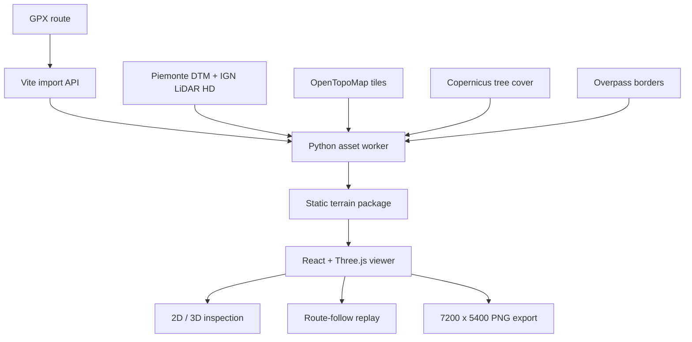
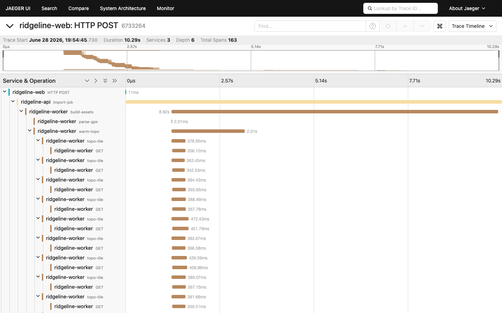

# Ridgeline

[](https://github.com/fblln/ridgeline/actions/workflows/ci.yml)

Ridgeline turns GPX routes into shareable 2D and 3D LiDAR terrain. It takes a
trek, bakes real elevation and map data into a static asset package, and opens it
in a React + Three.js viewer built for route inspection, cinematic camera work,
saved viewpoints, replay previews, and high-resolution image export.

The project is built around one goal: make mountain routes inspectable as real
terrain, not just as flat lines on a map.



*The sample route, `Escursione mattutina`, rendered as a raised red GPX tube over
a terrain mesh with a baked topographic texture, LiDAR relief, forest layer,
saved camera views, route replay, and image export.*

The committed README media shows a generated sample, but runtime terrain assets
are intentionally not checked into Git. Generate them locally before opening the
sample viewer (see [Quickstart](#quickstart)).

## Layout

The repo is a small monorepo:

| Path | Purpose |
|---|---|
| `web/` | Vite + React + Three.js terrain viewer and local GPX import API. |
| `tools/asset-baker/` | Legacy Python terrain/texture/route asset generator. |
| `tools/asset-baker-rs/` | Rust terrain/texture/route asset generator and import-worker replacement. |
| `examples/gpx/` | Sample GPX input used to regenerate the bundled showcase route locally. |

## What It Does

Ridgeline supports one high-quality bundled example and a local GPX import flow:

| Capability | What it does |
|---|---|
| **GPX to terrain** | Builds terrain around the route bounds instead of loading a generic map tile view. |
| **Real DEM fusion** | Uses Piemonte ICE 2009-2011 DTM at 5 m with IGN LiDAR HD fill where coverage needs it. |
| **3D route inspection** | Renders the trek as a raised tube over the terrain with orbit, free-camera, and route-follow modes. |
| **Layer switching** | Switches between topo, LiDAR shade, slope, forest, hypsometric, and plain surface views without rebuilding the scene. |
| **Camera workflow** | Saves useful viewpoints, frames the route, exposes altitude and route-distance readouts, and previews route replay. |
| **High-res export** | Renders the current camera as a 7200 x 5400 PNG for sharing or visual review. |
| **Import tracing** | Traces GPX imports through browser, Vite API, Python worker, DEM fetches, texture generation, and error logs. |

The default sample route is 21.6 km with +1539 m of elevation gain. The viewer
loads a 5988 m x 4805 m terrain extent, 1412 m to 2637 m elevation range, and a
10,488-point display route.

## Quickstart

Runtime terrain assets are intentionally not committed, so generate the sample
package first, then start the viewer.

### 1. Generate the sample terrain assets

Create a Python environment and install the baker dependencies:

```bash
python -m venv .venv
source .venv/bin/activate
pip install -r tools/asset-baker/requirements.txt
```

Bake the sample asset package (writes ignored runtime assets under
`web/public/assets/escursione-mattutina/`):

```bash
python tools/asset-baker/export_web_example.py examples/gpx/Escursione_mattutina.gpx
```

The Rust baker can generate the same viewer asset package and is available for
A/B import testing:

```bash
cd tools/asset-baker-rs
cargo build --release
cd ../..
tools/asset-baker-rs/target/release/baker examples/gpx/Escursione_mattutina.gpx
```

The local GPX import API uses the Rust worker by default. Start the web app with:

```bash
cd web
npm run dev
```

(Set `RIDGELINE_BAKER=python` to fall back to the Python baker.)

The Rust crate also builds a standalone import server. After building the web
bundle, run:

```bash
cd tools/asset-baker-rs
cargo run --release --bin server
```

### 2. Run the web app

```bash
cd web
npm install
npm run dev
```

Open <http://localhost:5173/> and load the sample area. (The app also runs
without baked assets — you just won't see the bundled sample until step 1
completes.)

Build and preview the production bundle from `web/`:

```bash
npm run build
npm run preview
```

## Dataset

The sample dataset is intentionally real and heavy enough to prove the pipeline,
not a toy demo. `Escursione mattutina` covers a cross-border alpine area near
Piemonte / France. The README media is committed, but the runtime terrain
package itself is ignored by Git and must be generated locally.

The showcase screenshots were captured from a max-quality bake:

| Asset | Showcase value |
|---|---:|
| Terrain grid | `3000 x 3000` height samples |
| Terrain JSON | `76 MB` |
| Topographic texture | `18 MB` PNG, up to `8192 px` |
| Full asset folder | `174 MB` |
| Route file | `846 KB` JSON |
| Display route | `10,488` sampled points |
| Route distance | `21.6 km` |
| Elevation gain | `+1539 m` |
| Terrain extent | `5988 m x 4805 m` |

The default baker command chooses a route-sized grid from `WEB_TARGET_RES_M`.
For this sample route it currently produces about a `1199 x 1199` grid and an
ignored asset folder. Use the explicit [max-quality command](#advanced-bakes)
when you need to reproduce the showcase-level bake.

The source stack is mixed because alpine coverage is mixed:

| Source | Used for |
|---|---|
| **GPX track** | Route bounds, distance, elevation profile, and replay path. |
| **Piemonte ICE 2009-2011 DTM** | Primary 5 m terrain source where available. |
| **IGN LiDAR HD / RGE ALTI** | Fill source around France/cross-border gaps and import-quality presets. |
| **OpenTopoMap tiles** | Draped topographic mosaic and visual map context. |
| **Copernicus HRL Tree Cover Density 2018** | Forest/canopy layer baked into `terrain-forest.png`. |
| **Overpass administrative boundaries** | France / Italy border overlay in local terrain coordinates. |

The web mesh can be denser than some source cells, but it cannot invent
real-world detail beyond the underlying DEM. Where the source is Piemonte DTM,
the true elevation source is still 5 m.

## App Experience

The app starts with a compact entry surface for search, coordinates, or GPX
import. Search and coordinate loading open the generated sample area after the
asset baker has written it locally; GPX import uses the real local worker pipeline.



When a GPX is imported, the UI exposes the actual generation pipeline instead of
hiding it behind an indeterminate spinner: worker startup, GPX parsing, DEM
fetching, route/terrain sampling, texture baking, relief/slope rendering, forest
layer generation, and final asset handoff.



### Terrain Layers

The same terrain mesh can be inspected through multiple baked textures. This is
useful because no single layer answers every question: topo gives context,
hillshade exposes terrain form, slope highlights steepness, and forest shows
canopy/land-cover hints.



### Export Workflow

The visible canvas stays interactive, but export temporarily renders the current
camera at 7200 x 5400 and returns a downloadable PNG preview.



## How It Works

Ridgeline has two main parts:

1. **Python asset baker** — `tools/asset-baker/export_web_example.py`
2. **Static web viewer** — the Vite + React + Three.js app in `web/`

The baker reads the GPX route, samples DEM sources, builds map and terrain
textures, converts route points into local projected meters, and writes a static
asset package under:

```text
web/public/assets/escursione-mattutina/
```

The browser then loads only static files:

```text
manifest.json
terrain.json
route.json
border.json
terrain-texture.png
terrain-topo-raw.png
terrain-hillshade.png
terrain-multishade.png
terrain-slope.png
terrain-hypso.png
terrain-forest.png
reference-render.png
reference-preview.jpg
angle-sheet.png
```

No Python runs in the browser. Once the asset package exists, the viewer can be
served as a static web app.



### Parallel Asset Generation

The expensive work is mostly network and image I/O, so the baker overlaps it
instead of running one long serial fetch:

| Parallel path | What happens |
|---|---|
| **Fetch workers** | `WEB_FETCH_WORKERS` defaults to `16`; DEM and topo tile fetches run through a `ThreadPoolExecutor`. |
| **Background prefetch** | Topo tile and forest cache warming start while the DEM source is being built. |
| **Named task spans** | Each parallel task can run as `dem-tile`, `topo-tile`, or `encode-relief`, so Jaeger shows the fan-out instead of one opaque worker span. |
| **Retrying downloads** | External HTTP fetches retry transient failures with light backoff because many concurrent tile requests make one-off network errors normal. |
| **Parallel texture writes** | Relief, slope, hypsometric, multishade, normal, and raw/topo outputs are encoded through the same worker helper. |

The point is not just speed. Parallelism makes the import UI and tracing honest:
the user can see whether time is going into DEM coverage, tile download,
texture rendering, forest data, or final JSON/PNG writes.

### Coordinate System

The web viewer uses a right-handed Three.js scene:

| Real-world direction | Scene axis |
|---|---|
| East | `+x` |
| North | `-z` |
| Elevation | `+y` |

Route and border points are stored in local projected meters. The viewer
recenters them around the terrain midpoint and applies vertical exaggeration at
render time.

## Engineering Highlights

| Area | Detail |
|---|---|
| **Terrain mesh** | Three.js `BufferGeometry` built from typed arrays for positions, UVs, colors, and indices. |
| **Visual quality** | High-resolution draped textures, anisotropic filtering, relief shader pass, SSAO, FXAA, and terrain-specific lighting presets. |
| **Camera rig** | Orbit, free-camera, and route-follow modes share one camera state so layer changes do not reset composition. |
| **Route replay** | Samples the route by distance, looks ahead on the track, offsets the camera for sightlines, and damps position/target changes. |
| **Import pipeline** | GPX upload starts a Vite API job, validates supported Piemonte/France bounds, runs the Python worker, writes generated assets, and loads the new manifest back into the viewer. |
| **Parallel workers** | Fetches and encodes run through bounded worker pools, with independent topo/forest prefetch overlapping DEM work. |
| **Observability** | OpenTelemetry traces browser fetches, API job handling, Python worker stages, worker-thread tasks, and external DEM/tile HTTP calls. |

The web render is designed to approach the Python/PyVista reference render, but
it is intentionally a browser renderer: it uses WebGL materials, screen-space
effects, and interactive camera controls instead of an offline VTK pipeline.

## Advanced Bakes

The default bake (in [Quickstart](#quickstart)) is route-sized. For a
showcase-level max-quality bake, run from the repository root:

```bash
WEB_DEM_SOURCE=mixed \
WEB_DEM_RES_M=1 \
WEB_GRID=3000 \
WEB_TEXTURE_MAX=8192 \
WEB_TILEZOOM=17 \
WEB_PIEMONTE_SAMPLE_ORDER=1 \
WEB_MESH_SMOOTH=0 \
WEB_RELIEF_SMOOTH=0.10 \
WEB_SLOPE_SMOOTH=0.6 \
WEB_ROUTE_STEP_M=2 \
python tools/asset-baker/export_web_example.py examples/gpx/Escursione_mattutina.gpx
```

Important knobs:

| Variable | Default | Meaning |
|---|---:|---|
| `WEB_DEM_SOURCE` | `mixed` | Piemonte DTM first, IGN fill second. Use `ign` to force IGN-only sampling. |
| `WEB_TARGET_RES_M` | `5` | Target ground resolution in meters per cell when grid is computed from route size. |
| `WEB_GRID_MAX` | `3000` | Maximum grid size per axis for generated terrain. |
| `WEB_GRID` | unset | Force a fixed grid size, bypassing target-resolution sizing. |
| `WEB_TEXTURE_MAX` | `8192` | Maximum terrain texture dimension. |
| `WEB_TILEZOOM` | `17` | OpenTopoMap zoom level for the topo mosaic. |
| `WEB_ROUTE_STEP_M` | `2` | Route simplification step for displayed route points. |

Higher values improve close-up detail only when the source data supports it.
Piemonte-backed cells still originate from a 5 m DTM.

## Development

| Area | Lint | Typecheck | Test |
|---|---|---|---|
| `web/` | `npm run lint` | `npm run typecheck` | `npm run test:run` |
| `tools/asset-baker/` | `ruff check .` | — | `pytest` |

Install the baker's dev tools with
`pip install -r tools/asset-baker/requirements-dev.txt`. CI
([`.github/workflows/ci.yml`](.github/workflows/ci.yml)) runs all of the above on
every push and pull request.

### Capture README Media

The screenshots and GIFs in this README are committed under
`web/docs/images/readme/`. They can be regenerated from the running app (in
`web/`) after the sample terrain assets exist:

```bash
npm run capture:readme
```

The script starts Vite on port `5177`, opens the generated
`Escursione mattutina` asset package, captures the entry screen, terrain
overview, layer comparison, route replay GIF, and export preview, then validates
screenshots with pixel variance checks so blank WebGL output fails the run.

If `web/public/assets/escursione-mattutina/manifest.json` is missing, the script
prints the baker command to run first.

## Tracing / APM

GPX import tracing is optional, but it is wired end to end. The browser starts
the trace when it uploads a GPX, the Vite API continues it for the import job,
and the API passes a W3C `TRACEPARENT` environment variable into the Python
worker. The worker then creates spans for parsing, elevation source selection,
sampling, texture generation, forest export, and per-task tile/HTTP calls.



*A real Jaeger trace from a Ridgeline import: browser POST → Vite `import-job`
→ Python `build-assets` → parallel `topo-tile` tasks → external HTTP `GET`
calls. This trace has 3 services and 163 spans.*

Start Jaeger before importing (from `web/`):

```bash
npm run jaeger
```

Then run the app, import a GPX, and open <http://localhost:16686/>.

Useful services:

| Tier | File | Service name |
|---|---|---|
| Browser | `web/src/otel.ts` | `ridgeline-web` |
| Vite API | `web/otel.node.ts`, `web/gpxImportServer.ts` | `ridgeline-api` |
| Python worker | `tools/asset-baker/ridgeline_baker/otel_worker.py` | `ridgeline-worker` |

Trace shape:

| Span / service | What it answers |
|---|---|
| `ridgeline-web: HTTP POST` | Did the browser upload and poll successfully? |
| `ridgeline-api: import-job` | How long did the whole import job take, and did it fail? |
| `ridgeline-worker: build-assets` | How long did Python asset generation take? |
| `parse-gpx`, `elevation-source`, `sample-elevation`, `textures` | Which build stage consumed time? |
| `dem-tile`, `topo-tile`, `warm-forest`, `encode-relief` | Which parallel worker tasks were active? |
| auto-instrumented `GET` spans | Which external DEM/tile endpoints were slow or errored? |

If the collector is down, imports still work. Trace export failures are ignored,
and failed jobs write a `build.log` next to the generated assets.

## Known Limits / Next Architecture

The current app is configured for maximum local quality, not public web
performance:

- The viewer loads one monolithic `terrain.json`.
- A 3000 x 3000 grid is near the practical ceiling for this architecture.
- Initial load is heavy because terrain and textures are large.
- Import job state lives in the dev server's memory and is lost on restart.
- Saved shots are local app state, not persisted to a backend.
- Route replay is a preview, not a full cinematic timeline editor.

The next architecture step is tiled terrain with level of detail:

1. Split the DEM into terrain tiles.
2. Store each tile as a binary height tile instead of one giant JSON file.
3. Generate multiple LOD levels per tile.
4. Stream high-resolution tiles near the camera and lower-resolution tiles in the distance.
5. Use matching tiled topo, relief, and land-cover textures.

That would keep the visual ambition while making public sharing and larger
routes practical.

## License

[MIT](LICENSE)
